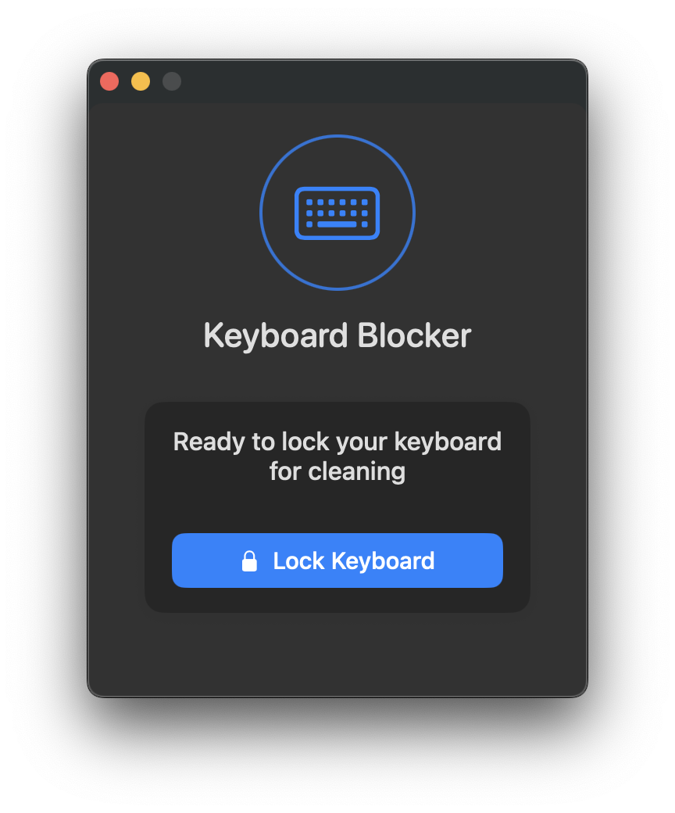

# KeyboardBlocker - macOS Keyboard Locking Utility

A lightweight macOS utility that temporarily locks your keyboard for cleaning. Prevents accidental key presses while cleaning your MacBook, Magic Keyboard, or any external keyboard connected to your Mac.

## 🌟 Key Features

- **Complete Keyboard Blocking**: Safely cleans your MacBook keyboard without triggering unwanted actions
- **Multi-Display Support**: Works seamlessly across all connected monitors
- **Easy ESC Escape**: Quickly unlock with a single ESC key press
- **Modern macOS Design**: Clean, native UI that follows Apple design guidelines
- **Privacy Focused**: Zero data collection, runs entirely on your local machine
- **Energy Efficient**: Minimal CPU and memory usage
- **Universal Binary**: Runs natively on both Apple Silicon and Intel Macs

## 🔧 Installation Options

### Download Pre-built Application
1. Visit the [Releases](https://github.com/yourusername/macos-keyboardblocker/releases) page
2. Download the latest `KeyboardBlocker.app.zip` file
3. Extract and move to your Applications folder
4. ⚠️ First time: Control+click and select "Open" to bypass Gatekeeper

### Build from Source Code
1. Clone this repository: `git clone https://github.com/yourusername/macos-keyboardblocker.git`
2. Open Terminal and navigate to the project directory
3. Run `swift build -c release`
4. Find the built executable at `.build/release/KeyboardBlocker`

## 📋 Usage Instructions

1. Launch KeyboardBlocker app
2. Grant Input Monitoring permission when prompted (required to block keyboard input)
3. Click "Lock Keyboard" when you're ready to clean
4. Clean your keyboard without worrying about accidental keypresses
5. Press the ESC key to unlock when finished

## 🔒 Privacy and Security

KeyboardBlocker runs entirely on your local machine and does not collect or transmit any data. The Input Monitoring permission is required solely to intercept and block keyboard events during cleaning.

## ⚙️ System Requirements

- macOS 11 (Big Sur) or later
- Compatible with Apple Silicon (M1/M2/M3) and Intel Macs
- Minimal disk space required (< 5MB)

## 🤝 Contributing

Contributions are welcome! Here's how you can help:
- Report bugs or suggest features through [Issues](https://github.com/yourusername/macos-keyboardblocker/issues)
- Submit improvements through [Pull Requests](https://github.com/yourusername/macos-keyboardblocker/pulls)
- Share the app with other Mac users

## 📝 License

This project is licensed under the MIT License - see the [LICENSE](LICENSE) file for details.

## 📱 Related Projects

- Looking for a similar tool for Windows? Try [WinKeyboardLocker](https://github.com/link-to-similar-windows-project)
- Need to clean your trackpad too? Check out [MacInputBlocker](https://github.com/link-to-similar-project)

## 🔍 Keywords

macOS keyboard cleaner, MacBook keyboard lock, keyboard cleaning utility, disable MacBook keyboard, prevent keyboard input, keyboard blocker, Mac keyboard cleaning tool, keyboard lock app, Mac keyboard disabler 